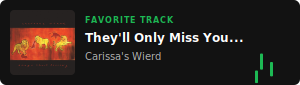

# Hello World, I'm Trevor Ohlson 👋

I am an incoming Computer Science student transferring to California State University, Sacramento, and a Technical Software Intern at Matter Advantage. I specialize in backend business logic, desktop integration tools, and automation pipelines—primarily working within the C# and Python ecosystems.

Beyond my university coursework and internship projects, I am passionate about data structures, algorithmic problem-solving, and building high-performance systems that solve real-world complexities cleanly.

### 🛠️ What I'm Up To:
* **Internship Engineering:** Contributing to an Avalonia UI desktop bridge application and a high-utility C# command-line PST automation generator for enterprise integration testing.
* **Side Projects:** Developing an AI-powered baseball swing analysis system designed to provide professional-level coaching feedback.
* **Interview Prep:** Actively solving algorithmic challenges using the LeetCode / NeetCode curriculum to master data structures and optimize runtime complexity.

### 💬 Let's Connect:
* **Ask me about:** C# development, Python scripting, object-oriented software architecture, or backend automation pipelines.
* **Fun Fact:** Started coding by accident back in 2021 and haven't stopped building since.
* **Professional Network:** [Connect with me on LinkedIn](https://linkedin.com/in/trevor-ohlson)

---

<h1> i really like music :headphones:</h1>

Here are a few highlights from my vinyl collection, spanning alternative rock, hip-hop, and modern pop:

### 🎵 My Favorite Tracks

| | |
| :---: | :---: |
|  |  |
|  |  |
|  |  |
|  |  |
|  |  |

_inspired by [andymruw](https://github.com/andymruw)_

---
# 💻 Tech Stack:
                          
